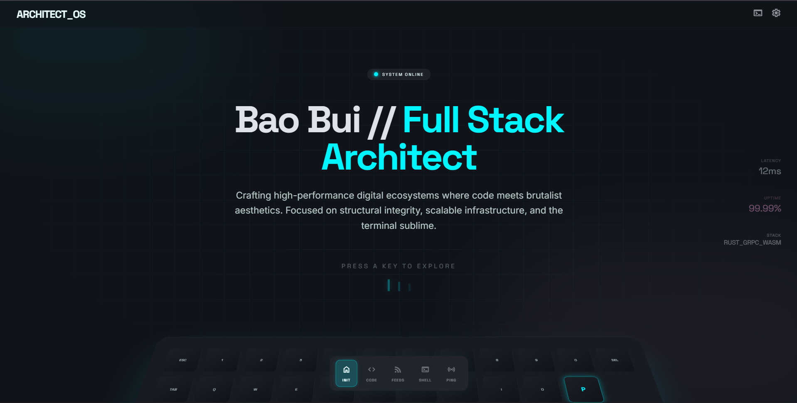

# Architect OS Portfolio

A terminal-inspired personal portfolio for **Bui Chi Bao**, built with React, Vite, Tailwind CSS, and React Router. The site presents profile information, CV-based project highlights, contact flow, onboarding guidance, and keyboard-style navigation in a neon developer-console interface.

## Features

- Terminal-style landing page with an interactive keyboard launcher.
- Global `ESC` shortcut to return to the home route.
- First-visit onboarding tour stored with `localStorage`.
- Header terminal palette for quick navigation and CV download.
- Header settings panel for scanlines, neon glow, and reduced motion.
- Profile page populated from CV data.
- Projects page featuring CV-backed projects and tech stacks.
- Contact form with email validation, Formspree endpoint support, and custom toast feedback.
- Responsive dark glass/neon UI with Tailwind CSS.

## Shortcut Map

On the home page:

| Key   | Route       |
| ----- | ----------- |
| `P`   | `/profile`  |
| `A`   | `/projects` |
| `C`   | `/contact`  |
| `S`   | `/feeds`    |
| `ESC` | `/`         |

Across the whole website, pressing physical `ESC` navigates back to `/`.

## Tech Stack

- React 19
- Vite 6
- React Router DOM 7
- Tailwind CSS 3
- PostCSS / Autoprefixer
- Formspree-ready contact endpoint

## Getting Started

Install dependencies:

```bash
npm install
```

Start the development server:

```bash
npm run dev
```

## Project Structure

```text
src/
  components/
    layout/        Shared shell, top navigation, and bottom dock
    ui/            Reusable UI pieces, keyboard, toast, onboarding tour
  data/            Navigation, profile, and project content
  pages/           Route pages for home, profile, projects, feeds, contact
  styles/          Global Tailwind and custom CSS
```

## Home Preview


